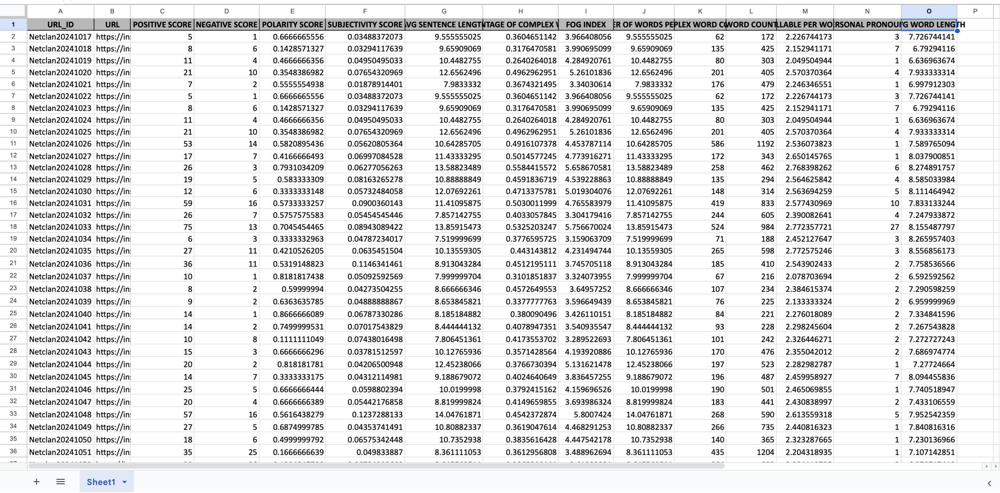

# Web Scraping & Text Analysis Project (Blackcoffer)

This project scrapes content from Blackcoffer articles and performs **NLP-based text analysis**. It extracts metrics like sentiment scores, readability indices, syllable counts, and more. Output is generated in a structured Excel file as per the given format.

# Work Flow & Approach

1. Scraping the Articles (scraper.py)
-> Read input from Input.xlsx containing URL_ID and URL columns.
-> For each URL, fetch the HTML content using Selenium and BeautifulSoup.
-> Extract the Title and Body Text of the article.
-> Save each article as a .txt file inside the text_files/ folder named by its URL_ID.

2. Text Analysis (text_analysis.py)
-> This script performs Natural Language Processing (NLP) and readability analysis using NLTK and other libraries. It calculates:
-> Sentiment Scores: Positive, Negative, Polarity, Subjectivity.
-> Readability Metrics: Avg Sentence Length, Fog Index, % Complex Words.
-> Text Stats: Word Count, Syllables per Word, Complex Words Count.

We used:
A custom StopWords folder for filtering words.
MasterDictionary for pre-defined lists of positive and negative words.
All results are saved in the exact format defined by Output Data Structure.xlsx.

---

## 📁 Project Structure
Project_web-scrapping/
├── MasterDictionary/             # Contains positive and negative word lists
├── StopWords/                    # Stopword files used in filtering
├── text_files/                   # Text content of each article
├── Input.xlsx                    # Contains URL_ID and URL of articles
├── Output Data Structure.xlsx    # Final output in required format 
├── text_analysis.py              # Text analysis and feature extraction
├── scraper.py                    # (Optional) Web scraping script
└── README.md                     # Project documentation

## Requirements 

# Data handling
pandas==2.2.1
openpyxl==3.1.2

# Web scraping
selenium==4.19.0
beautifulsoup4==4.12.3

# Text processing
nltk==3.8.1

# Excel support for pandas
xlrd==2.0.1

# Optional (in case needed for UTF-8/special handling)
chardet==5.2.0

After installing everything, run the following once in Python to download tokenizer data:

python->
import nltk
nltk.download('punkt')

# How to Run
-> python text_analysis.py

It will automatically:
Load text from text_files/
Analyze it
Export results to: Output Data Structure.xlsx

## 📸 Sample Output Snapshot

Here is a snapshot of the final output Excel file:

 